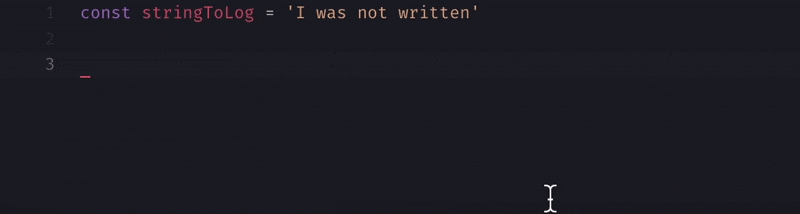
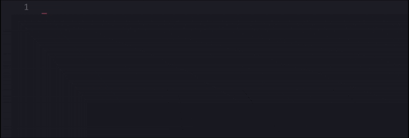

   
 

Add this line in your settings.json to priority snippets autocomplete

> `"editor.snippetSuggestions": "top"`

## Commands
| Commands             | Description           |
| -------------------- | :-------------------- |
| lg                   | Log clipboard content |
| dumb                 | Dumb component        |
| compose              | Basic recompose layer |
| datarecompose        | Data layer            |
| staterecompose       | State layer           |
| wstaterecompose      | State shorthand       |
| handlersrecompose    | Handlers layer        |
| whandlerrecompose    | Handler shorthand     |
| hooksrecompose       | Hooks layer           |
| cdm, cdu, scu, cwu   | Lifecycles shorthand  |
| propsmapperrecompose | Props Mapper layer    |

## Usage

### lg - console.log clipboard's content

### dumb - Create dumb component

### compose - Base enhancer layer

### datarecompose - Data layer

### staterecompose - State layer

### handlersrecompose - handler layer

### hooksrecompose - Lifecycle hooks layer

### propsmapperrecompose - Props Mapper layer

### Supported extensions
> `(js, jsx, ts, tsx)` 

